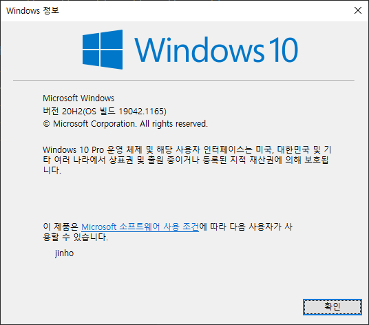
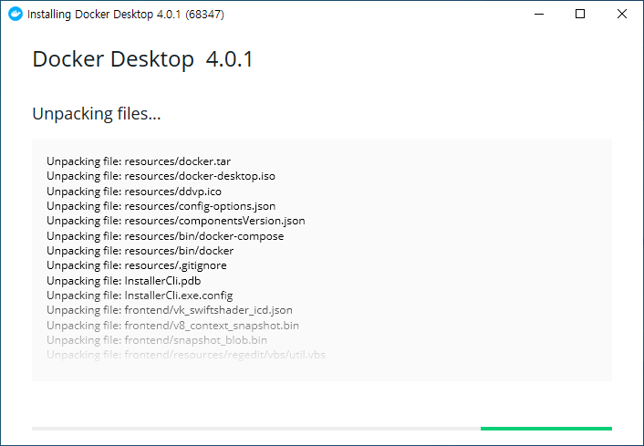
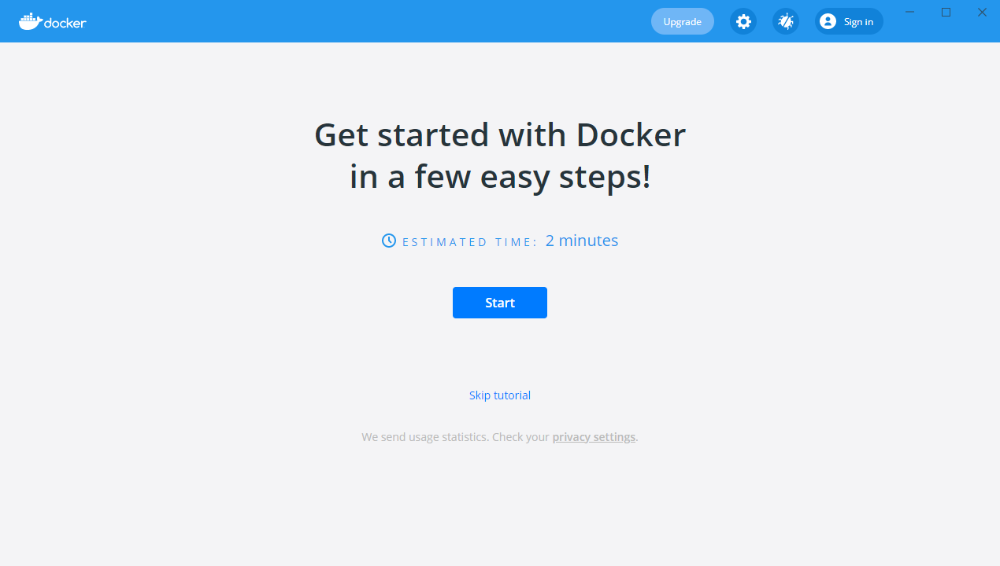
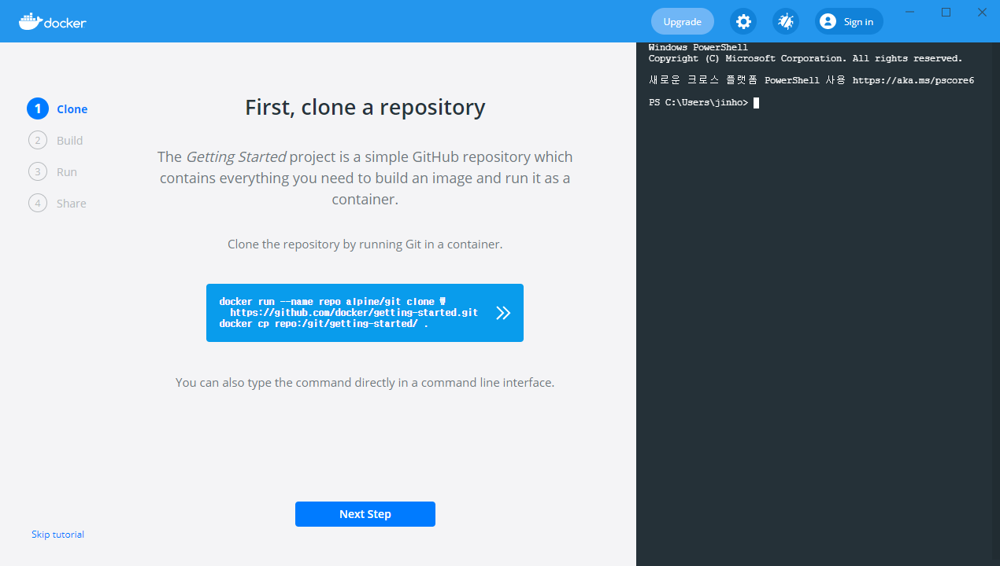
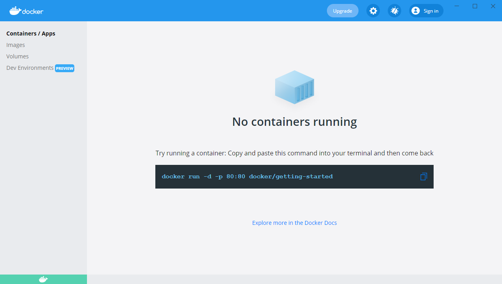
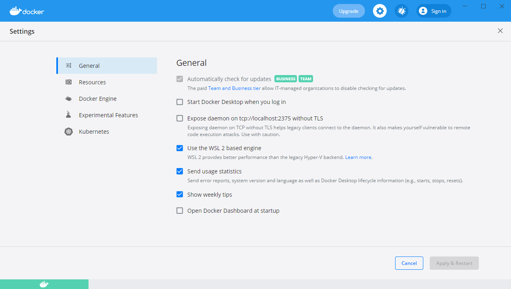
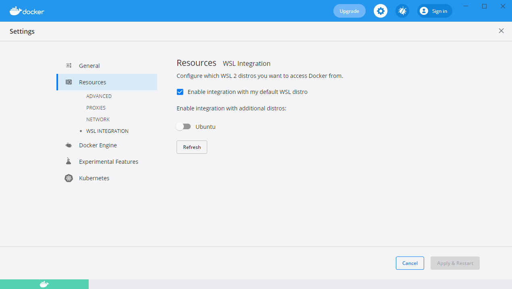
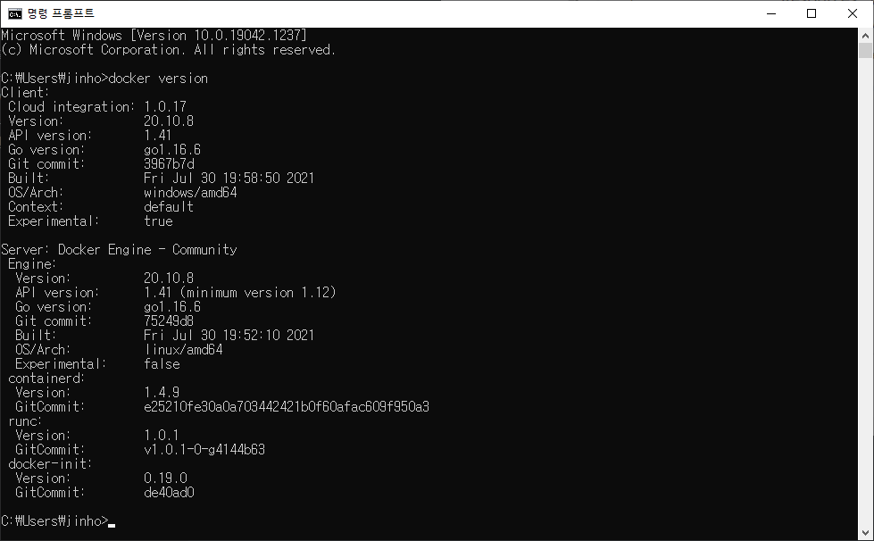

# 2. 도커 설치

## 2-1. 윈도우 10(windows 10)에 도커 설치하기

### 2-1-1. 운영체제 확인하기

- Window 10에 도커를 설치하기 전에 본인이 사용중인 Window가 어떤 에디션인지 확인해야 한다.

  > window + S를 입력한 뒤 검색창에 winver를 검색 후 실행하면 설치된 윈도우의 버젼을 확인할 수 있다.

  

- Window 10 Pro 혹은 Home에 따라 Hyper-V 기능을 사용할 수 있는지 여부가 달라지게 된다.

  > Hyper-V란?
  >
  > Microsoft사에서 제공해주는 가상화 툴이다. 윈도우 운영체제에서 Hyper-V를 사용하면 가상 머신으로 여러 운영 체제를 실행할 수 있게 도와준다.
  >
  > Window 10 Pro, Enterprise 및 Education 64비트 버젼에서 사용할 수 있다.

- Docker Desktop은 기본적으로 Hyper-V기능을 사용하기 때문에 Window 10 Pro Edition에서만 사용이 가능했다. Home Edition에서 사용 가능하도록 Docker Toolbox가 대안으로 제시되었지만 현재는 공식적으로 지원이 종료된 상태이다.

- 2020년 5월 Window 10이 업데이트 되면서 WSL2가 정식 릴리즈 되었다.

  > WSL2란?
  >
  > Windows Subsystem for Linux 2의 약자이다. 윈도우에서 리눅스를 사용할 수 있게 해주는 기능이다.

- 윈도우 Pro 사용자는 WSL2를 이용하지 않아도 Hyper-V 기반 가상화를 사용해 Docker Engine을 사용하는 것이 가능하지만, Home Edition 사용자와 동일하게 WSL2를 사용하는 것도 가능하기 때문에 Home과 Pro 공통으로 사용 가능한 WSL2를 이용하는 방식으로 설치를 진행할 것이다.


### 2-1-2. WSL2 설치

- PowerShell 또는 Window 명령 프롬프트(cmd)에서 간단한 명령어 입력을 통해 WSL2를 설치할 수 있다.

- 설치를 위해 관리자 권한이 필요하기 때문에 반드시 관리자 권한으로 PowerShell 혹은 Window 명령 프롬프트를 실행해야 한다.

- 아래의 명령을 입력하여 WSL2 설치를 진행한다.

  ```powershell
  wsl --install
  ```

  

- 설치 후에는 시스템을 다시 시작하여 변경 사항을 적용해야 한다.

- 시스템을 다시 시작한 이후 리눅스(ubuntu)가 설치가 되며, 사용자 정보를 설정해야 한다.

  ****

- WSL2 x64용 최신 WSL2 Linux 커널 업데이트 패키지를 다운받아 설치한다. [다운로드 링크](https://wslstorestorage.blob.core.windows.net/wslblob/wsl_update_x64.msi)

- Window Terminal을 열고 다음 명령을 실행한다.

  ```powershell
  wsl --set-default-version 2
  ```

  

- 그 밖에도 WSL2의 추가 설정들을 해야 사용이 가능하지만 Docker를 사용하는 경우 여기까지만 셋팅하면 가능하다.

참고 : [Microsoft 공식 문서 WSL 설치 가이드](https://docs.microsoft.com/ko-kr/windows/wsl/install)


### 2-1-3. 도커 파일 다운로드

- 도커(Docker) 공식 사이트에서 Docker Desktop for window 파일을 다운 받는다.

  

  

- 도커 설치파일을 실행하여 Docker Desktop을 설치한다.

  

  

- 설치된 Docker Desktop을 실행하여 정상적으로 동작하는지 확인한다. 성공적으로 실행되었다면 아래와 같은 초기 셋업 화면이 나타날 것이다.

  

  

- 튜토리얼 화면이 나오게 되면 건너 뛰고 진행한다.

  

  

- 성공적으로 도커 설치가 완료되고 Docker Desktop 실행이 완료되면 아래와 같은 화면이 나오게 될 것이다.

  

  

- 도커 설정 메뉴의 General 탭에서 Use the WSL 2 based engin에 체크가 되어 있는지 확인한다.




- Resources 탭의 WSL INTEGRATION 메뉴에서 Enable integration with my default WSL distro 에 체크가 되어 있지 않다면 체크하고 Apply & Restart를 해 주면 Docker Desktop이 재시작 된다. (체크가 되어 있다면 설정은 추가로 해주지 않아도 된다.)

  

  

- 여기까지 진행했다면 WSL2 기반 도커 설치는 모두 완료된 것이다.

  

### 2-1-4.  설치된 도커 버젼 확인

- Window 명령 프롬프트 혹은 PowerShell을 실행하여 아래 명령을 입력하고 설치된 도커 버젼을 확인해본다.

  ```powershell
  $ docker version
  ```

  
  
  

---


---
