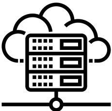
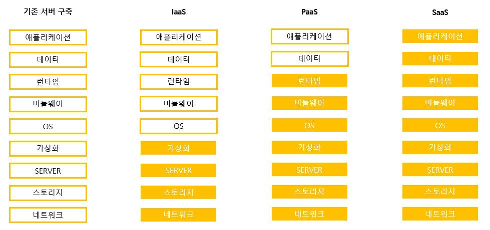
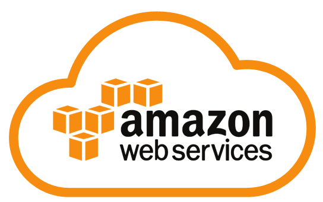
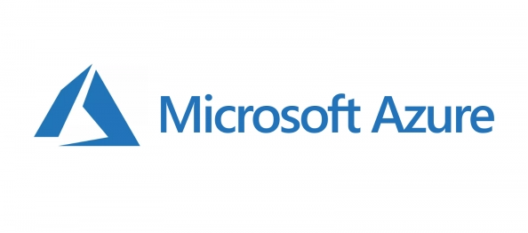
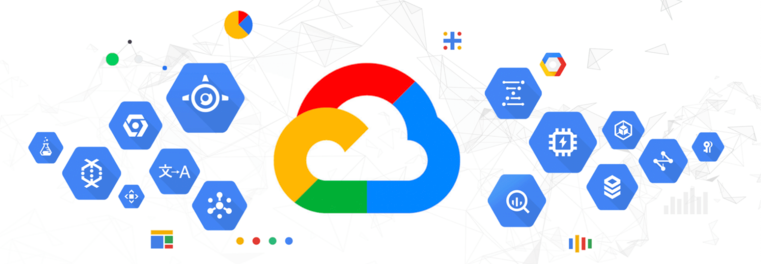

# 1. 클라우드 서버

## 1-1. 클라우드 서버 개요

### 1-1-1. 클라우드서버란?

  

 

- 클라우드 서버(=클라우드 컴퓨팅)의 개념은 1965년 과학자 존 매카시가 하나의 컴퓨터를 여러명의 유저가 공유하며 동시에 작업을 펼치는 방식으로 값비싼 메인프레임을 대체할 수 있다는 주장에서 유래되었다.
- 2006년에 Amazon이 클라우드 컴퓨팅서비스를 시작하였고, 첫 번째로 시작된 서비스는 사람들이 컴퓨터에 접근하여 클라우드 환경에서 자신의 응용프로그램을 실행할 수 있도록 도와주는 Elastic Compute Cloud (EC2) 였다.
- 클라우드 서버란 인터넷 상에 가상화된 서버이며, 필요할때마다 접근해서 사용할 수 있는 서버이다.
- 인터넷 통신망에만 접근할 수 있다면 컴퓨터 자원(CPU, 메모리, 디스크 등)등을 원하는 대로 가져다가 사용할 수 있다.
- 클라우드 서버는 처리성능, 스토리지, 애플리케이션 제공 등 기존의 물리 서버와 동일 기능을 수행한다. 물리서버보다 좋은 점은 필요한 성능에 따라 유동적으로 선택이 가능하다.
- 클라우드 서버는 가상화를 통해 구현된다. 하이퍼바이저라는 관리 소프트웨어가 물리적 서버에 설치되어 서버를 연결하고 가상화를 하면, 결합되어 있는 자원들을 추상화하여 가상의 서버를 만들어 낸다.
- 클라우드 특성에 따라 IaaS, PaaS 와 같이 나눠진다.

### 1-1-2. 클라우드 서비스 모델(Cloud Service Model)

- IaaS(Infrastructure as a Sercie)
    - 가상 서버, 호스팅, 스토리지, 가상 네트워크 등의 리소스를 서비스로 제공한다.
    - 사용자는 물리적인 자원을 직접 관리하지 않아도 되며, 제공자가 서비스하는 페이지에서 간단하게 조작이 가능하다.
    - 사용한 만큼만 비용을 지불하면
    - AWS, 마이크로소프트 애저, 등이 있다.
- PaaS(Platform as a Service)
    - 미들웨어와 데이터베이스 관리, 애널리틱스, OS 등을 제공한다.
    - 하드웨어, OS, 미들웨어와 같은 관리는 서비스 제공자가 하며, 사용자는 제공된 미들웨어만 사용 가능하다.
    - 하드웨어나 운영체제에 신경쓰지 않고 애플리케이션을 실행할 수 있다.
- SaaS(Software as a Service)
    - 소프트웨어 또는 애플리케이션 기능을 제공한다.
    - 네이버 클라우드, 웹 메일, 등과 같은 서비스를 사용할 수 있다.

### 1-1-3. 클라우드 서버의 장점

| 장점 | 설명 | 
| :---: | ----|
| 경제성 | 클라우스 서버를 사용하면 자체 인프라를 구매하여 관리할 때보다 기업이 부담하는 비용이 감소한다. 또한 유동적으로 서버의 갯수나 자원을 변경할 수 있으며 사용하는 리소스에 대해서만 비용을 지불하면 된다.|
| 편의성 | 서버 구축을 몇 분 안에 할 수 있으며, 서버 자원 관리 또한 클라우드 서버 회사에서 담당하기 때문에 관리 리소스 부담도 줄어든다.|
| 확장성 | 서버 저장소나 자원에 변화가 필요할 때 확장 또는 축소를 통해 수요에 대한 공급을 빠르게 대처할 수 있다.|
| 안정성 | 클라우드 서버는 물리 서버와 동일한 성능을 제공하며, 공유환경에서 여러 서버가 돌아가고 있어서 한 서버에 문제가 발생해도 빠르게 복구 및 서비스를 지속할 수 있다.|

### 1-1-4. 클라우드 서버의 단점

- 데이터 센터를 대체할 수 있는 클라우드의 유연성과 편의성은 입증되었지만 안전성에 대한 우려가 있다. 클라우드 서비스 제공자의 서버가 정전 또는 트래픽 충돌 등의 이유로 정상적인 서비스가 불가능할 시 해당 서비스를 사용하는 모든 고객이 사용이 불가능하다.
- 즉, 많은 고객들이 클라우드에 전적으로 의존하고 있기 때문에 클라우드 서비스를 제공하는 자의 인적 또는 기계적 사고로 인해 서비스가 불가능할 시에 제공업체와 고객 모두에게 막대한 피해가 간다.

### 1-1-5. 클라우드 서버를 도입하는 이유

- 기업이 새로운 제품이나 서비스를 제공하고자 할 때 서버 리소스를 적시에 제공받을 수 있다.
- 클라우드 서버의 경우 이론상 무한대로 확장이 가능하다. 네트워크 상의 트래픽이나 컴퓨팅 리소스가 더 필요한 경우 클라우드 서버의 업그레이드 또는 새로운 자원의 추가로 확보할 수 있다.
- 초기 투자 비용이 기존의 물리적인 설치방식에 비해 적다. 이미 구성되어 제공되는 클라우드 제공자에게서 필요한 만큼 적은 비용으로 구축이 가능하다.

## 1-2. 클라우드 서버 제공 회사

### 1-2-1. 아마존웹서비스

- 2004년 11월 심플 큐 서비스(SQS)를 공개하면서 퍼블릭 클라우드 서비스를 시작했다.
- 2006년에는 클라우드 스토리지, S3, 컴퓨팅 자원 EC2, 큐 서비스 SQS를 통합적으로 제공했다.
- Amazon Web Service는 네트워킹을 기반으로 가상 서버를 제공할 뿐 아니라 네트워크 인프라, 등 다양한 서비스를 제공한다.
- 전 세계에 175개가 넘는 데이터 센터를 보유하고 있으며, 전세계 점유율 1위 서비스이다.

### 1-2-2. 마이크로소프트 애저

- 2010년에 개시한 마이크로소프트의 클라우드 컴퓨팅 플랫폼이다.
- 전세계 클라우드 시장 2위로, 1위인 AWS를 추격하고 있다.
- AWS에 비해 후발주자로 부족한 부분을 가격 경쟁력으로 따라잡으려고 하고 있다.
- 크레딧을 이용해 결제를 할 수 있으며, 직접 사거나 MSDN 구독, 비즈스파크 등을 이용해 얻을 수 있다.

### 1-2-3. 구글 클라우드

- 2011년 10월에 개시한 구글사의 클라우드 플랫폼이다.
- 2018년 기준으로 전 세계 클라우드 컴퓨팅 시장에서 3위를 차지하고 있다.
- 구글 계정이 있는경우 해당 계정을 이용하여 구글 클라우드를 사용할 수 있다는 장점이 있다.