# 2. 아마존웹서비스(AWS) 가입하기

## 2-1. AWS 주요 서비스 소개

> 아래 서비스 외에도 다양한 AWS 서비스가 존재하며, 더 자세한 내용은 AWS [공식 홈페이지 참조](https://aws.amazon.com/ko/?nc2=h_lg)

### 2-1-1. AWS EC2(Elastic Compute Cloud)
- AWS에서 가장 기본적이고 많이 쓰이는 인프라이며, 네트워크 망에서 가상 서버를 제공한다.
- EC2는 한마디로 가상 머신이라고 볼 수 있으며 하나의 서버(가상머신)을 인스턴스라고 한다.
- EC2는 AWS에서 제공하는 인터페이스를 통해 유동적인 스펙의 서버를 빠르게 구축할 수 있다.

### 2-1-2. AWS S3(Simple Storage Service)

- S3는 AWS에서 제공하는 오브젝트 스토리지 서비스이다.(사진, 비디오, 문서 등)
- 파일 저장은 bucket(또는 컨테이너)을 통해 운영되며 다른 유저들의 액세스도 컨트롤 할 수 있다.
- 무제한적인 확장성과 높은 가용성과 내구성을 보장하며 단일 파일을 최대 5TB까지 업로드 할 수 있도록 지원한다.

### 2-1-3. VPC(Virtual Private Cloud)

- 아마존 VPC는 계정별로 격리된 네트워크 환경을 구성할 수 있는 서비스이다.
- 서브넷, Route Table, ACL, 보안 그룹 등을 이용해 논리적인 네트워크 분할 작업을 할 수 있다.
- 계정 안, 또는 계정 간 격리된 네트워크를 연결할 수 있는 옵션도 제공한다.
- VPC는 AWS 리소스간 허용을 최소화하고 그룹별로 네트워크를 구성하기 쉽게 하기 위해 사용한다.

### 2-1-4. IAM(Identity and Access Management)

- 권한 관리를 지원해주는 서비스이다.
- AWS에선 일반적으로 계정을 생성시 Root 계정이며, 이 계정은 모든 권한을 가지고 있으며 보안적으로 문제가 발생할 수 있기 때문에, IAM은 사용자계정 및 그룹 생성하여, 권한을 제어하는 기능을 제공한다.

### 2-1-5. Route 53

- Domain Name System, 도메인 관리/설정 서비스이다.
- EC2 인스턴스, Elastic 로드 밸런서, S3 저장소 등 AWS 서비스 인프라에 연결하여 사용한다.
- Route53을 통해 자신이 가지고 있는 도메인과 연결하거나, Route53에서 도메인을 구입할 수도 있다.

### 2-1-6. ECS(Elastic Container Service)

- AWS의 매니지드 컨테이너 오케스트레이션 서비스이다.
- ECS에 클러스터를 생성하고 EC2 인스턴스를 등록할 수 있다. ECS에서는 서비스와 Task로 도커 컨테이너를 운영하며, 클러스터에 등록된 EC2 인스턴스 위에 도커 컨테이너를 스케줄링한다.

### 2-1-7. EKS(Elastic Kubernetes Service)

- 관리형 쿠버네티스 서비스이다. 해당 서비스를 이용하면 쿠버네티스 마스터노드 구성을 하지 않아도 AWS에서 관리를 해주며, 빠르게 쿠버네티스를 사용할 수 있다.
- 해당 서비스를 구축하기 위해서는 EKS 클러스터 생성과 노드 그룹을 생성해야 한다.

### 2-1-8. SQS(Simple Queue Service)

- 관리형 메시지 큐 서비스로 AWS의 첫번째 서비스이다.
- 애플리케이션간 메시지를 전달하기 위한 Queue이다.
- SQS는 메시지가 전달된 순서대로 정확히 처리하는 FIFO 대기열을 지원한다.

### 2-1-9. Lambda

- 서버리스 컴퓨팅 서비스이다. 해당 서비스는 애플리케이션을 실행하기 위한 별도 서버 없이 코드를 바로 실행해주는 서비스이다.
- 고정 비용 없이 사용 시간에 대해서만 비용이 발생한다.
- EC2는 초단위로 비용이 발생하는 반면 람다는 1ms당 요금을 계산하여 사용한 만큼 좀더 정교한 비용이 발생된다.

## 2-2. AWS 프리티어

### 2-2-1. AWS 프리티어란?

- AWS에서 제공하는 처음 가입한 이후 1년동안 서버를 서비스별로 정해진 한도내에서는 무료로 사용할 수 있는 서비스이다.
- 모든 서비스가 무료가 아니기 때문에 불필요한 과금이 되지 않도록 항상 주의해야 한다.

### 2-2-2. 프리티어 무료 서비스

> 아래 서비스 외에도 더 많은 서비스가 무료로 제공되고 있으며, 자세한건 [공식 홈페이지 참조](aws.amazon.com/free)

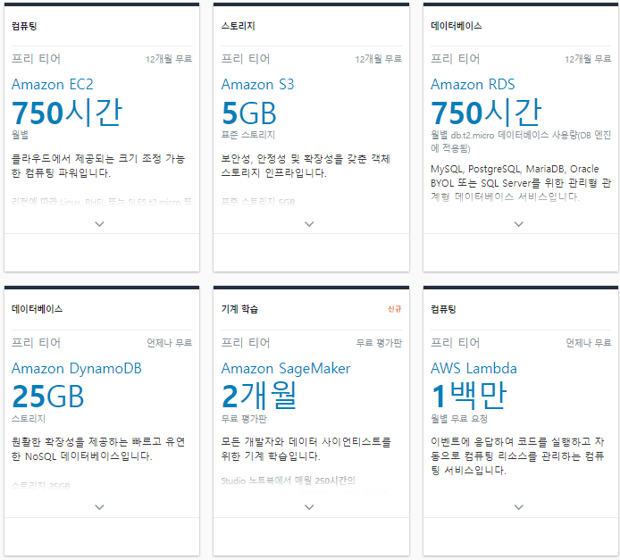

### 2-2-3. 프리티어 종류

- 12개월 무료 : 신규 고객에게만 제공되며 가입일로부터 1년(12개월) 까지만 적용된다. 
               무료 기간이 지나거나 트래픽 사용량이 프리 티어 한도를 넘어가는 경우 사용량에 따라 표준 서비스 요금을 지불해야한다.
- 언제나 무료 : 1년의 AWS 프리 티어 기간이 끝나도 자동으로 만료되지 않으며, 
              기존 및 신규 AWS 고객 모두에게 무기한으로 제공된다.
- 평가판 : 처음 서비스 시작일로부터 단기간 사용 가능한 평가판이다. 
          기간이 지난 이후에는 사용량에 따라 표준 서비스 요금을 지불하면 된다 
    
### 2-2-3. 프리티어 가입하기

1. 무료 계정 생성
> aws.amazon.com/free 에 접속하여 무료 계정 생성 클릭 (웹페이지는 변동 가능성 있음)

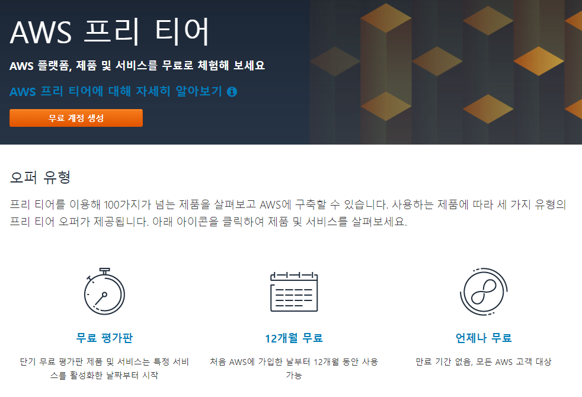

2. 로그인시 사용할 이메일과 정보를 기입하여 가입 진행

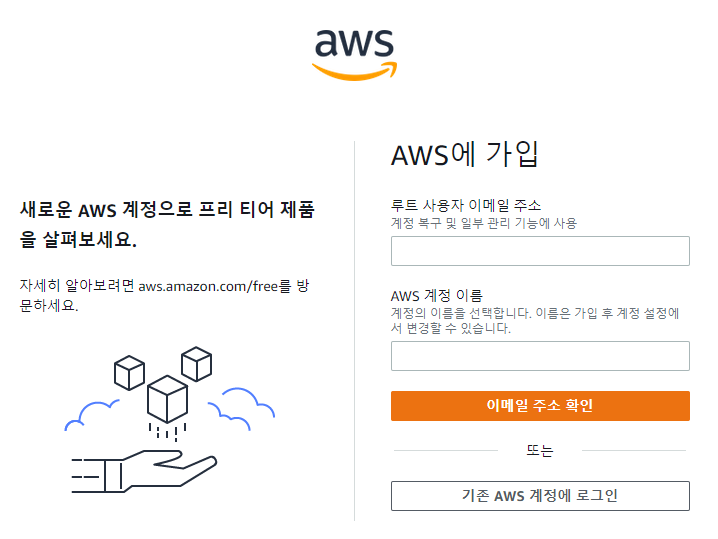

3. 이메일 인증 후 암호 설정

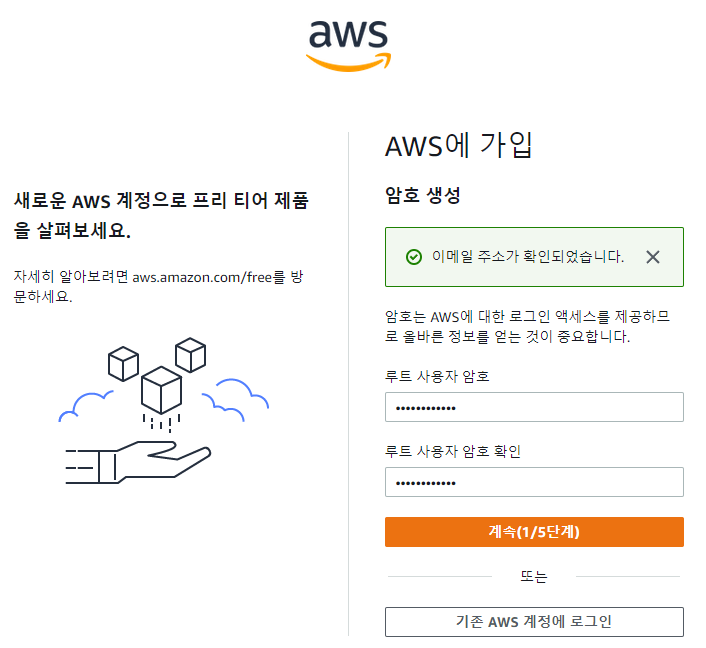

4. 개인 정보 입력 및 리전 설정
> 대한민국 국가코드는 +82이며, 핸드폰 번호 앞에 010에서 맨 앞에 0은 뺴고 입력한다.
> ex) +82 1012341234
> 
> 국가 또는 리전은 대한민국으로 설정한다.

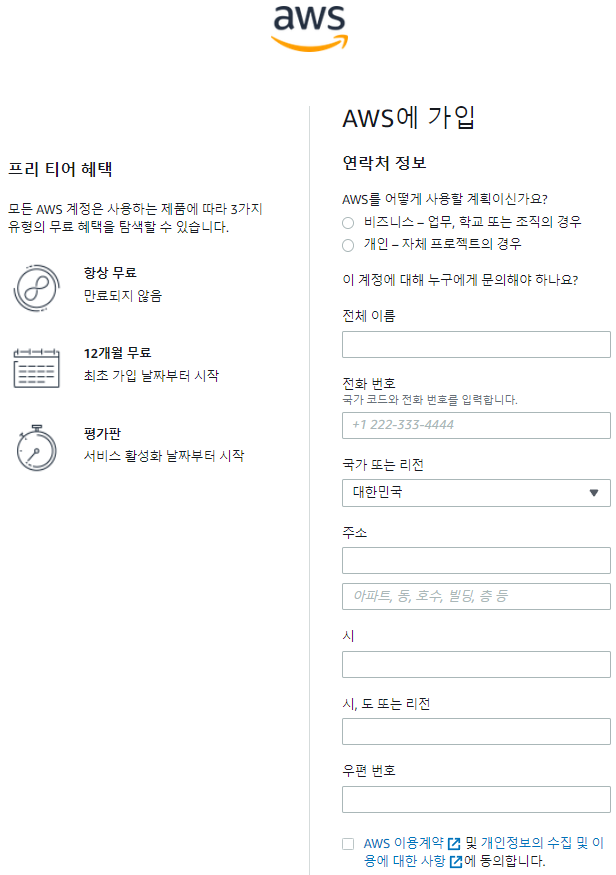

5. 카드 정보 인증 진행
> 프리티어는 일반적으로 무료지만, 트래픽 추가분에 대해서는 결제가 이루어지기 때문에 결제수단 인증도 진행한다.
> 인증을 진행하면 100원 빼었다가 다시 돌려준다.

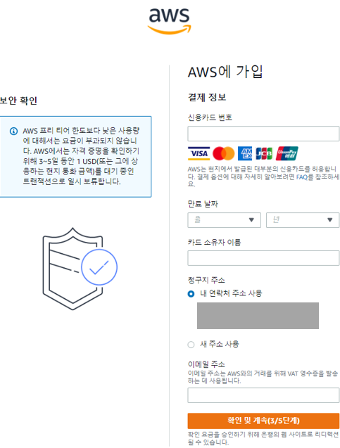

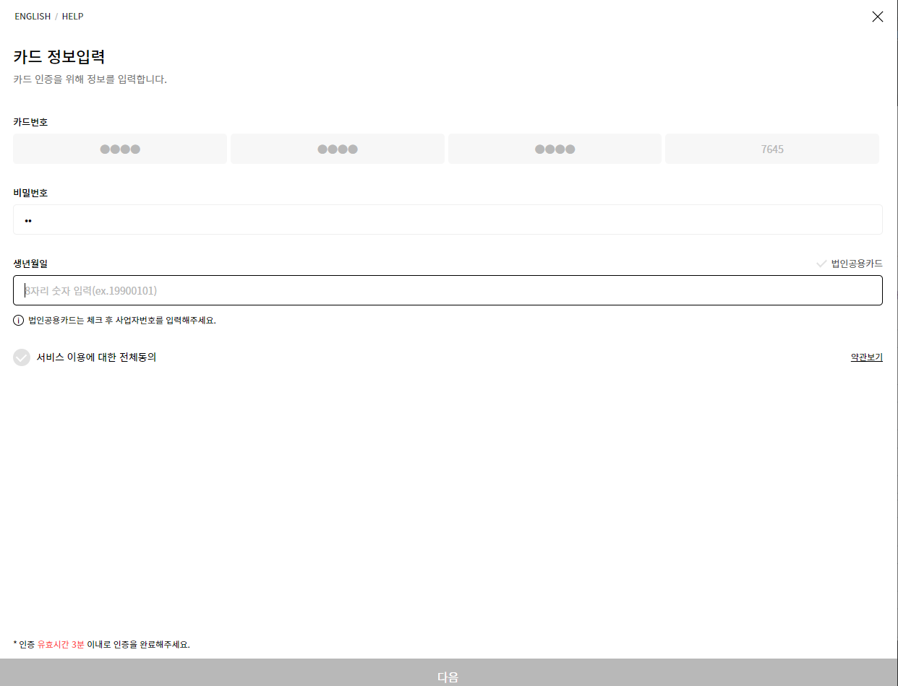

6. 전화번호 인증 진행
> 국가 또는 리전 코드는 대한민국으로 세팅하여 핸드폰 번호 인증을 진행한다.

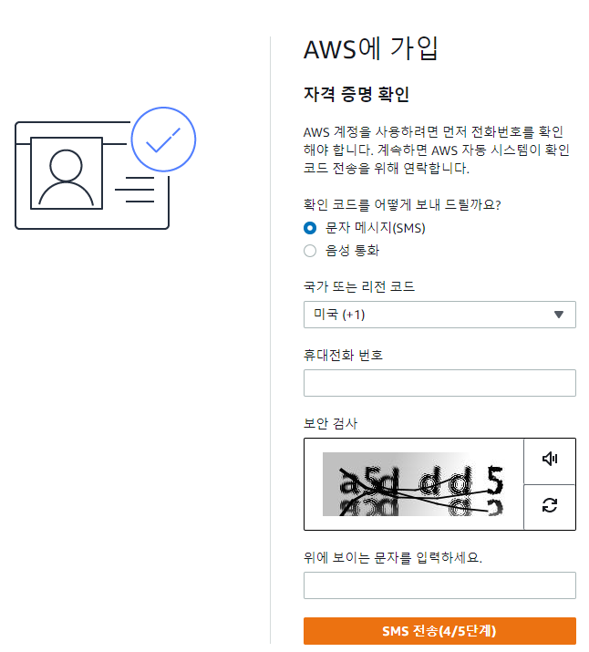

7. 계정 요금 세팅을 진행한다.
> 우리는 테스트 용이기 때문에 무료 버전으로 진행한다.

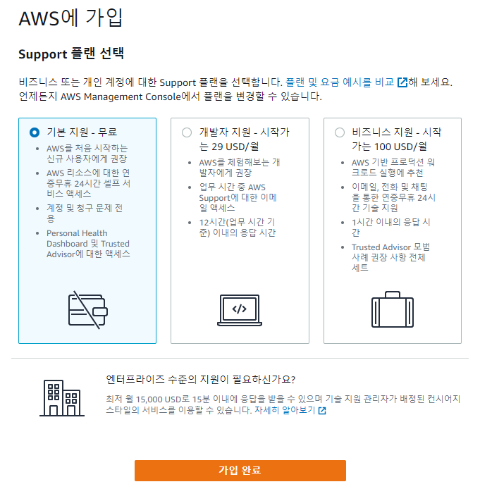

8. 가입이 완료되었다.

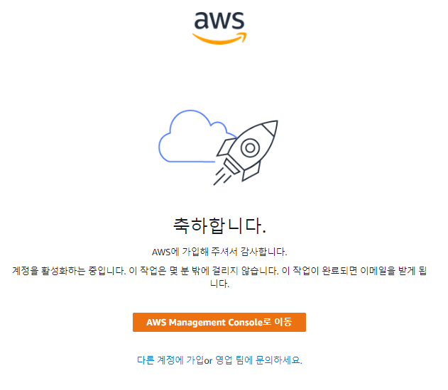

### 2-2-4. 로그인하여 리전 설정

1. 로그인
> 우측 상단에 콘솔에 로그인을 클릭하여 가입한 아이디로 로그인한다.

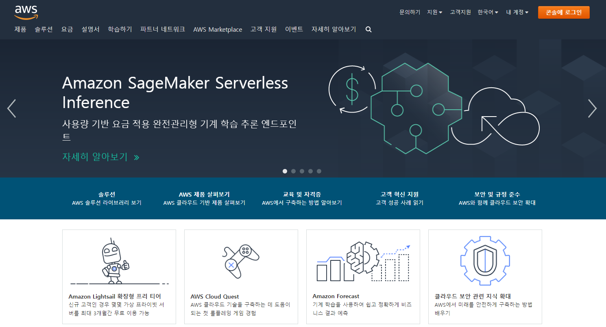

2. 루트 사용자로 로그인

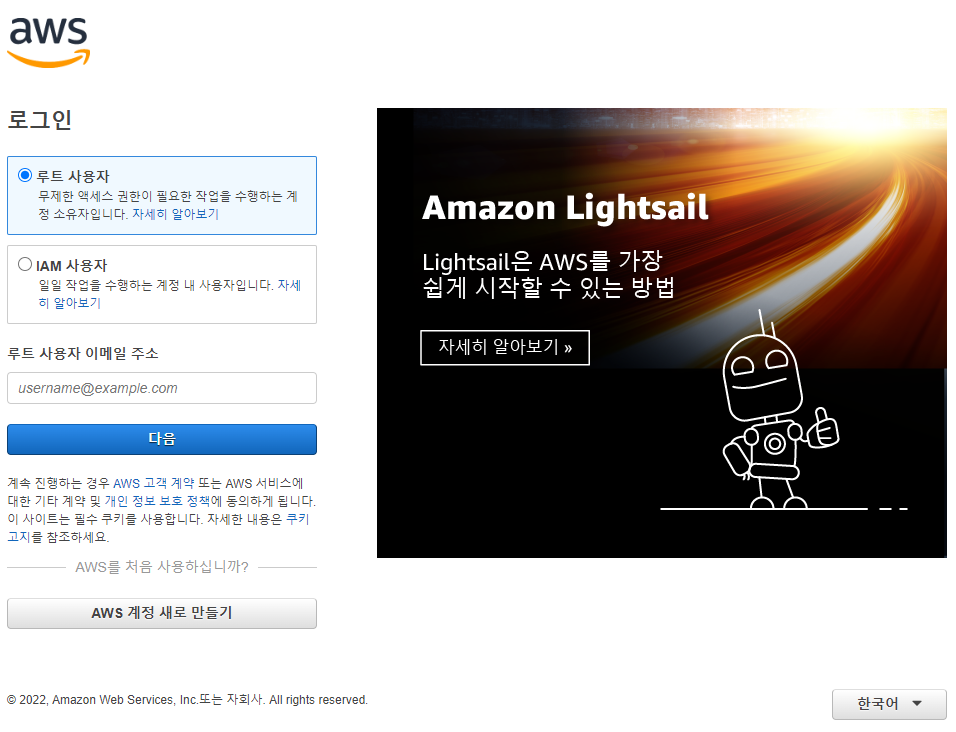

3. 지역 변경
> 오른쪽 상단에 있는 리전을 "아시아 태평양(서울)"로 변경한다. 
> 유료로 사용할 계획이 있는 경우 지역마다 요금이 다르기 때문에 가격을 확인한후 자신에게 유리한 설정을 하는 것이 좋다.

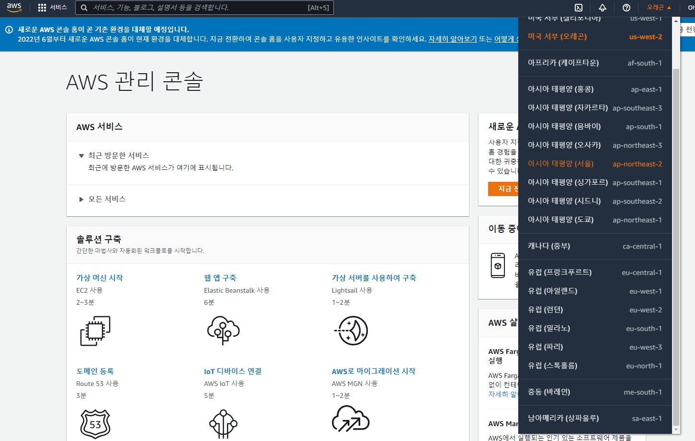
