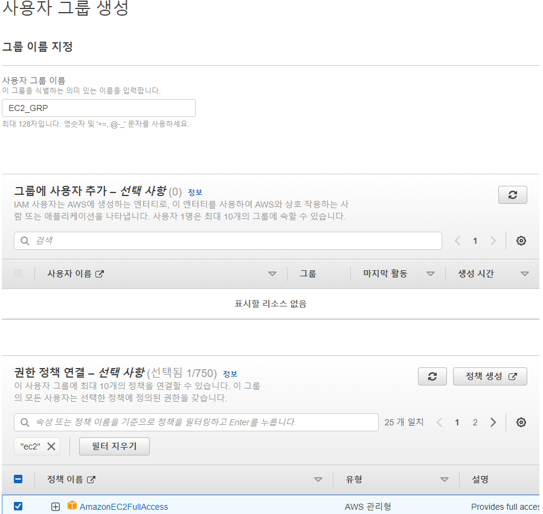

# 3. IAM 세팅

## 3-1. IAM 개요

### 3-1-1. IAM 이란?

> IAM(Identify and Access Management)의 약자로 간단히 말해 보안을 위한 자원 접근 권한 설정 서비스이다.
> 기본적으로 AWS에 Instance를 생성하면 Root 계정으로 접속을 하게 된다. 
> 이는 보안적으로 매우 취약하므로 서비스마다 계정 권한을 세분화 하여 관리하는 것이 좋다.
> 이번 순서에서는 IAM 서비스를 통해 EC2 서비스에만 접근할 수 있도록 권한을 세팅할 것이다.

## 3-2. IAM 세팅하기

### 3-2-1. IAM 그룹 생성하기

1. 검색창에 IAM 입력
> aws 검색창에서 서비스 검색을 할 수 있다. IAM 을 입력하여 해당 관리 페이지로 이동한다.

2. 사용자 그룹 생성
> 좌측 중단에 있는 사용자 그룹을 클릭하여 해당 탭을 활성화 시킨후 그룹 생성 버튼을 눌러 그룹을 생성한다.

3. 그룹 정보 입력
> 그룹 이름과 권한 정책 연결을 해준다. 연결한 권한은 EC2 Full Access 이다.

4. 그룹 생성 완료

### 3-2-2. IAM 사용자 생성하기

1. 사용자 생성
> 좌측 중단에 있는 사용자 탭을 눌른후 사용자 추가를 클릭한다.

2. 이름 및 액세스 유형 선택
> 이름과 유형을 선택한 후 다음을 눌러 진행한다.

3. 그룹에 사용자 추가
> 추가시킬 그룹을 선택한 후 다음을 누른다.

4. 태그 설정
> 당장은 사용하지 않기 때문에 Name만 추가한 후 다음을 누른다.

5. 사용자 생성 완료
> 이제까지 설정한 정보를 확인한 후 사용자를 만들기를 완료한다.

6. 액세스키 저장
> 생성이 완료 된 이후 비밀키를 .csv 파일로 제공한다. 이 파일은 안전한 곳에 저장하고, 외부에 절대 노출하면 안된다.

### 3-2-3. IAM 역할 생성하기

1. 역할 만들기
> 좌측에 있는 역할탭을 누른 후 역할 만들기 버튼을 누른다.

2. 사용 사례 선택
> AWS 서비스 엔티티에서 EC2 사용사례를 선택 후 다음을 누른다. 

3. 권한 설정
> 정책 필터에서 S3를 입력한 후 S3 Full Access 권한을 찾아 체크박스를 클릭한다. 이후에 다음을 누른다.

4. 역할 생성 완료
> 역할 이름과 설명을 기입하고 이상이 없는지 지금까지 설정한 내용을 다시 확인한다. 이상이 없으면 역할을 생성한다.

