# 4. AWS 인스턴스

## 4-1. EC2 인스턴스 생성

### 4-1-1. 인스턴스 생성

###[리뉴얼 전]
1. 가상 머신 세팅을 위한 페이지로 이동
> EC2 인스턴스 생성을 위한 페이지로 이동하기 위해 가상 머신 시작을 클릭한다.

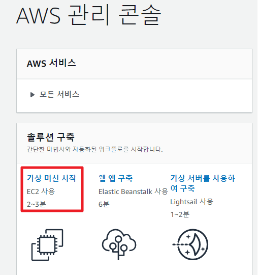

2. 리눅스 버전 선택
> 왼쪽부분에 "프리 티어만" 체크박스 선택시 프리티어로 사용 가능한 리눅스 버전만 노출된다. 
> Ununtu Server 22.04 LTS(HVM), SSD Volumne Type을 선택한다.

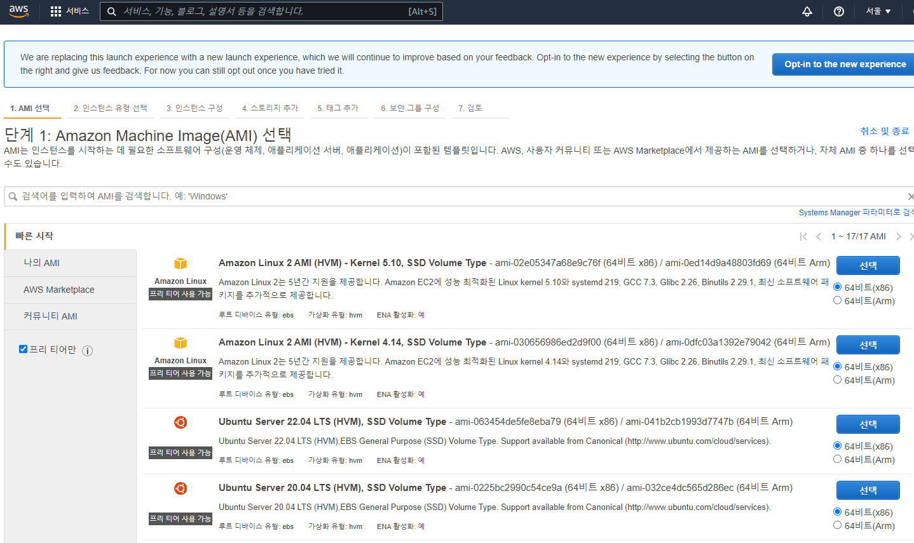

3. 인스턴스 유형 선택
> 프리티어용으로 인스턴스유형을 선택한 후 화면 하단에 보이는 검토 및 시작을 클릭한다.
> 그러면 좀더 자세하게 인스턴스 세팅을 설정할 수 있는 페이지로 이동된다.

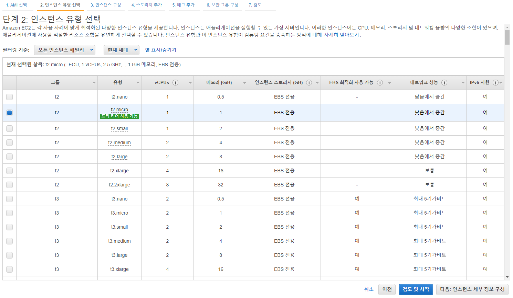

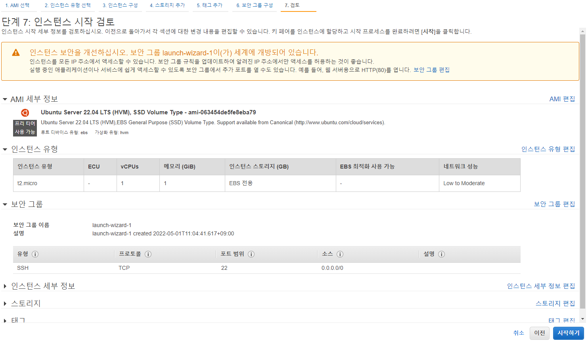

4. 보안 그룹 편집
> EC2 방화벽을 설정해야한다. 여기에 등록하지 않은 포트는 사용이 불가능하다. 
> 규칙 추가를 통해 다음과 같이 사용가능한 포트를 열어둔다. 세팅이 완료되면 검토 및 시작을 누른다.

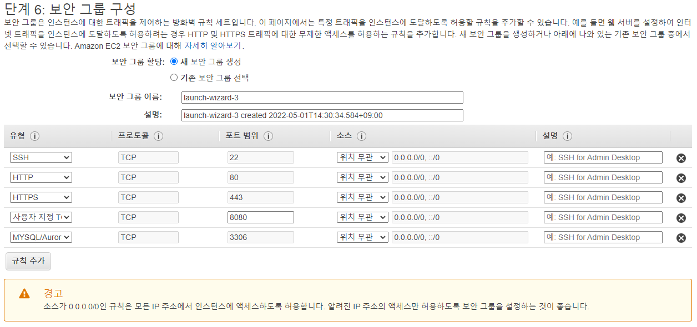

5. 인스턴스 세부정보 편집
> 인스턴스 세부 정보에서 미리 생성해둔 IAM 역할로 세팅해준다. 세팅이 완료되면 검토 및 시작을 누른다.

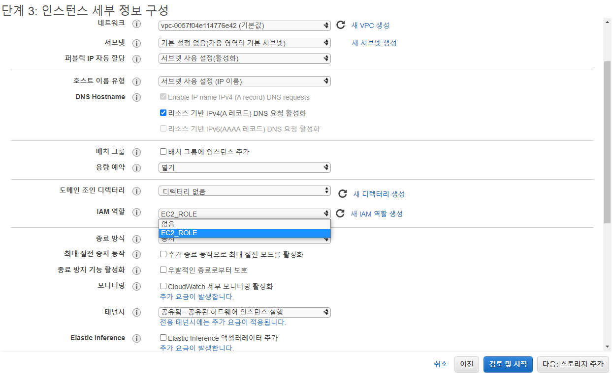

6. 스토리지 편집
> 스토리지는 30GB까지 프리티어에서 사용 가능하므로 해당 용량으로 세팅한 후 검토 및 시작을 누른다.

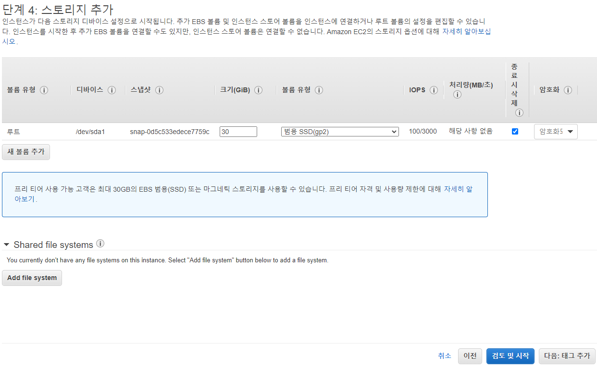

7. 키 페어 생성
> 설정을 마친후 시작하기를 클릭하면 키페어 관련 알림 메시지가 뜬다. 키 페어는 SSH 접속을 위한 키 쌍을 말한다.
> "새 키 페어 생성" 을 선택하고 키 페어 이름을 지정한 후 "키 페어 다운로드"를 클릭하면 .pem 파일이 다운로드 된다. 
> 이 pem 파일이 있어야 aws에 있는 리눅스에 SSH로 접속할 수 있다.

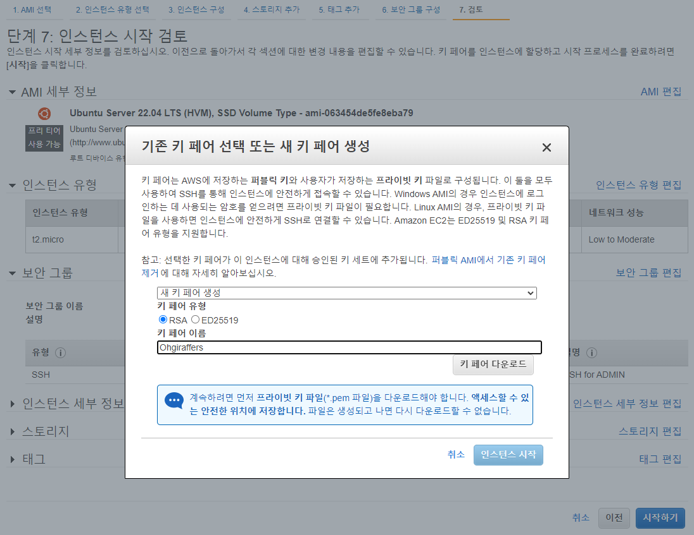

8. 인스턴스 시작
> 키 페어 다운로드하면 인스턴스 시작 버튼이 활성화 된다. 버튼을 누르면 인스턴스 생성이 완료된다. 
> 전환된 페이지에서 "예상 요금 알림 받기" 란이 있다. 이 부분을 클릭하여 혹시나 모를 결제를 대비해 예상 요금 알림 받기 버튼을 눌러 결제 관련 안내를 받을 이메일도 설정한다. 
> 세팅이 다 완료된 이후에는 다시 돌아와서 화면 오른쪽 하단에 인스턴스 보기를 클릭한다.

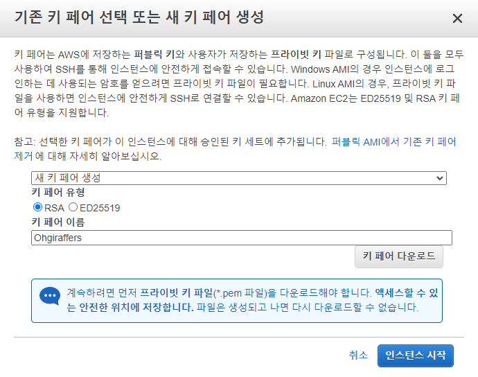

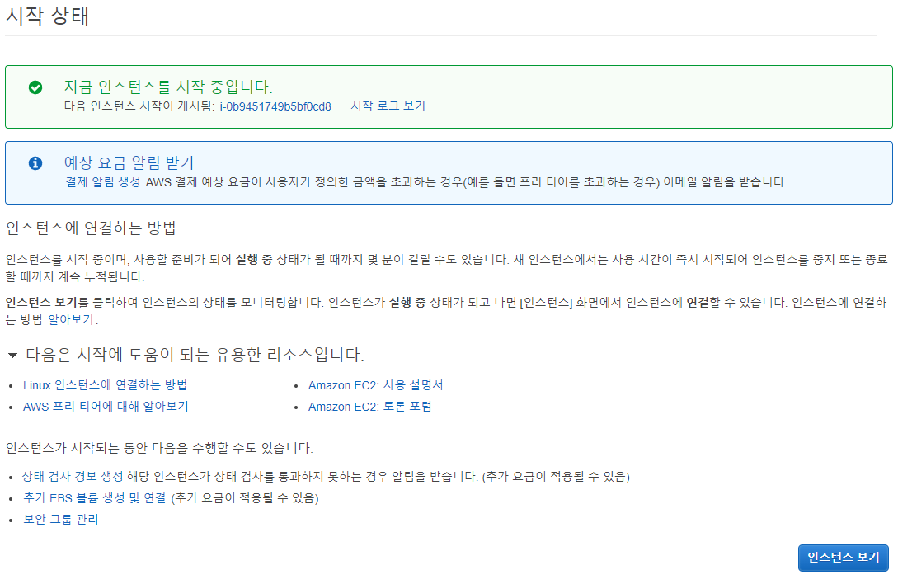

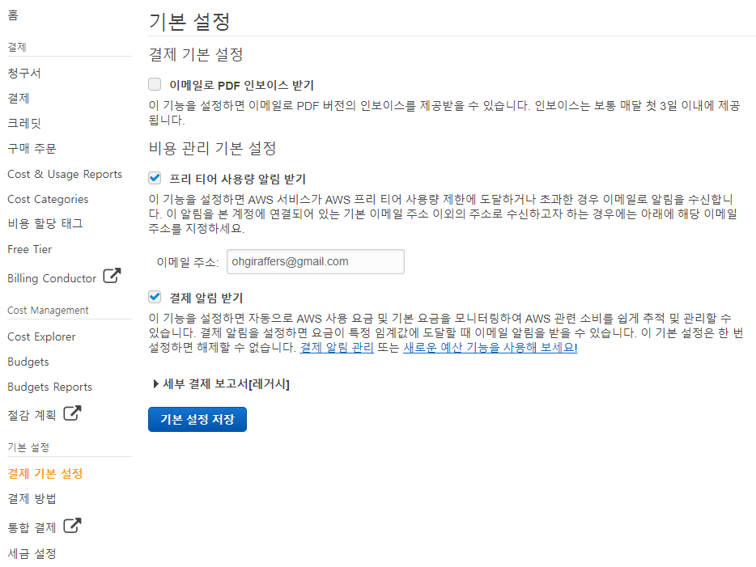

9. 인스턴스 생성 완료
> 인스턴스가 완료가 되면 기본적으로 실행중인 상태인데, 사용중이지 않을 때는 중지 상태로 변경을 해둔다.
> (인스턴스 종료는 인스턴스가 삭제되므로 주의한다.)
> 인스턴스를 오른쪽 클릭하면 아래와 작은 설정창이 활성화된다.

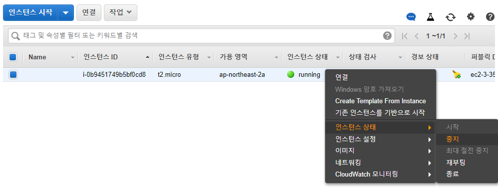

###[리뉴얼 후]
1. 가상머신 세팅을 위한 페이지로 이동
> 2022.06 월부터 관리 콘솔이 변경된다. 인스턴스 생성에 관한 세팅을 한 페이지에서 진행할 수 있다. 인스턴스 이름을 지정한다.

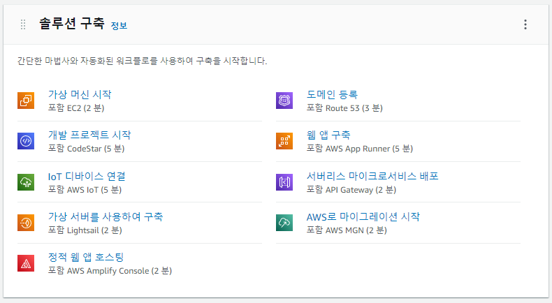

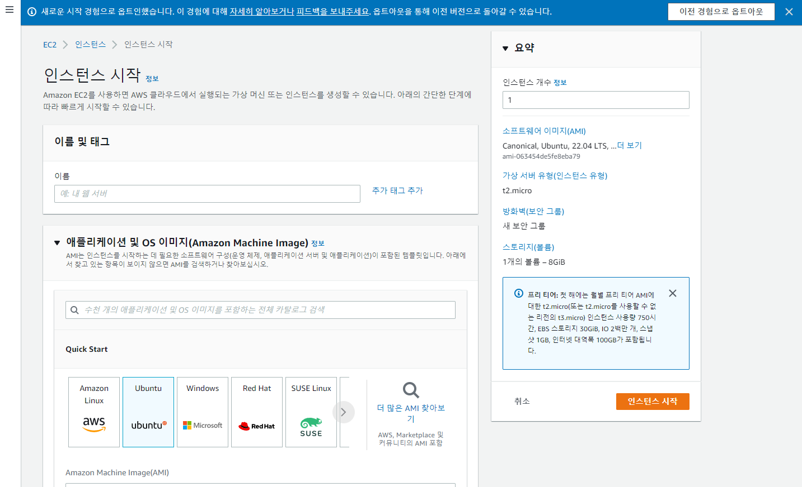

2. 리눅스 버전 선택
> 리눅스는 프리티어에서도 사용 가능한 Ubuntu Server 22.04 LTS 로 지정한다.

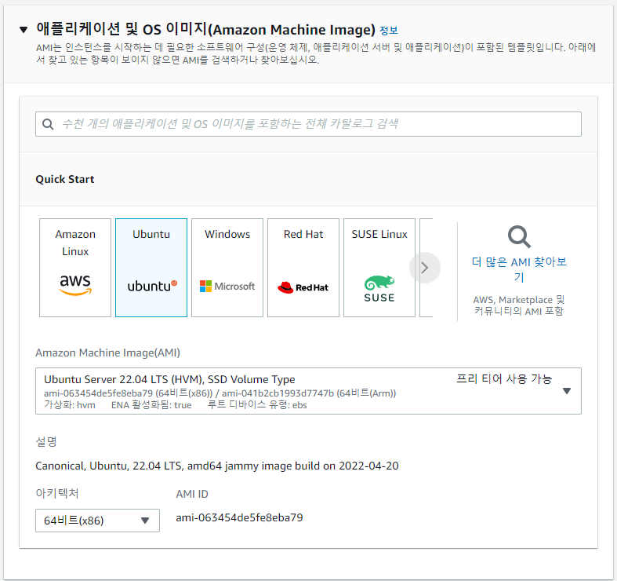

3. 인스턴스 유형 선택
> 인스턴스 유형 또한 프리티어에서 사용할 수 있는 t2.micro를 선택하여 진행한다.

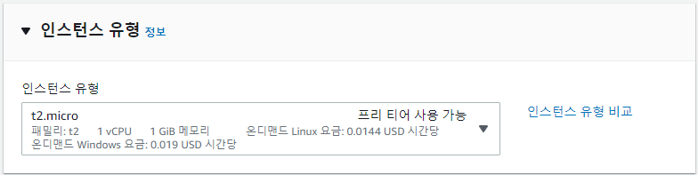

4. 키페어 생성
> SSH 접속을 하기 위한 키 페어를 생성한다. 키 페어는 SSH 접속을 위한 키 쌍을 말한다.
> 키 페어에 대한 세팅을 완료하면 .pem 파일이 다운로드 된다.
> 이 pem 파일이 있어야 aws에 있는 리눅스에 SSH로 접속할 수 있다.

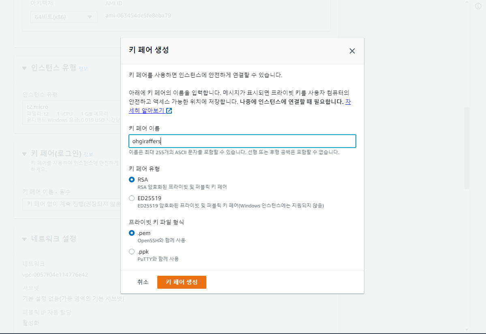

5. 보안 그룹 편집
> EC2 방화벽을 설정해야한다. 여기에 등록하지 않은 포트는 사용이 불가능하다.
> 다음과 같이 사용가능한 포트를 열어둔다.

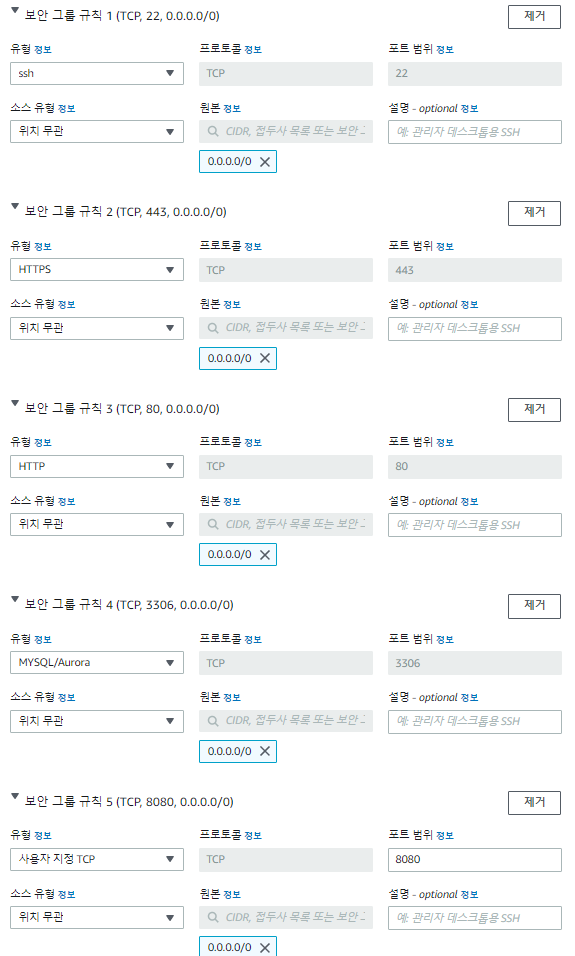

6. 스토리지 편집
> 프리티어 등급에서는 30G 까지 사용가능하므로 30GB로 세팅한다.

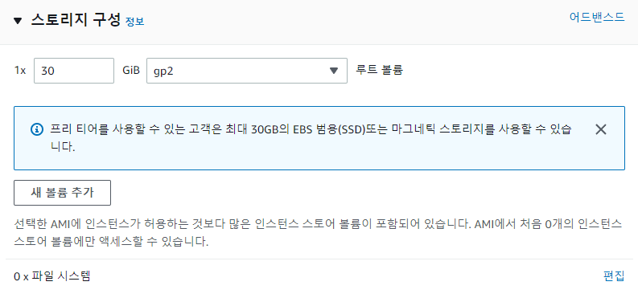

7. IAM 세팅
> 고급 세부정보에서 IAM 인스턴스를 미리 생성한 EC2_ROLE로 세팅한다.

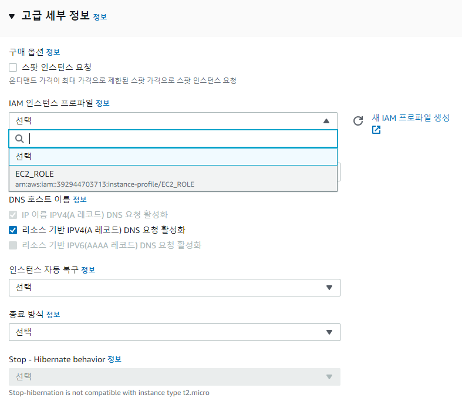

6. 인스턴스 시작
> 인스턴스 세팅이 끝나면 화면 최하단에 자신이 설정한 인스턴스에 대한 정보를 볼 수 있다.
> 인스턴스 시작을 눌러 생성을 완료한다. 
> 전환된 페이지에서 혹시나 발생할 금액을 확인하기 위해서 "결제 알림을 생성"을 눌러 결제 알림을 받을 이메일을 지정한다.

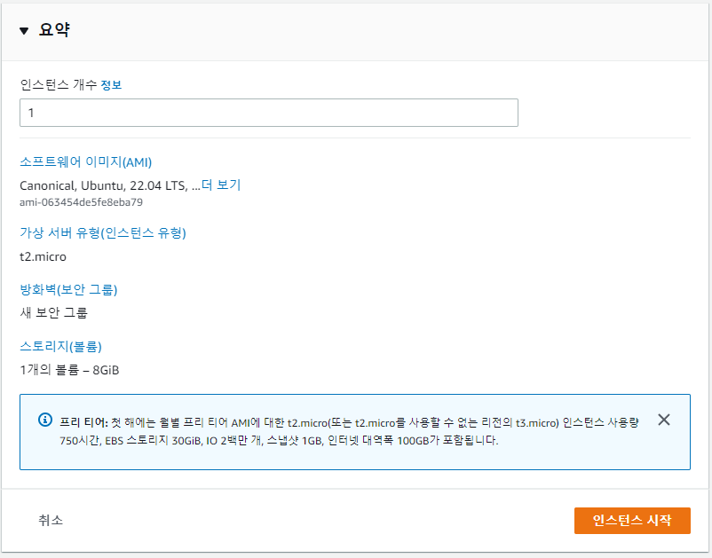

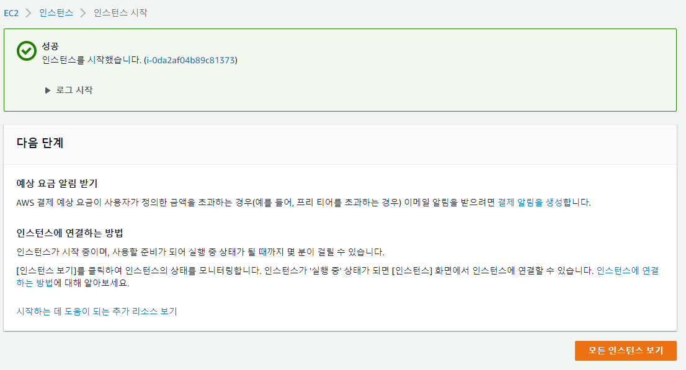