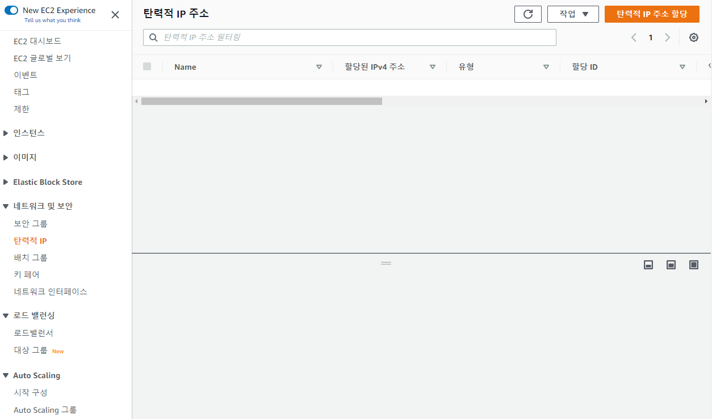
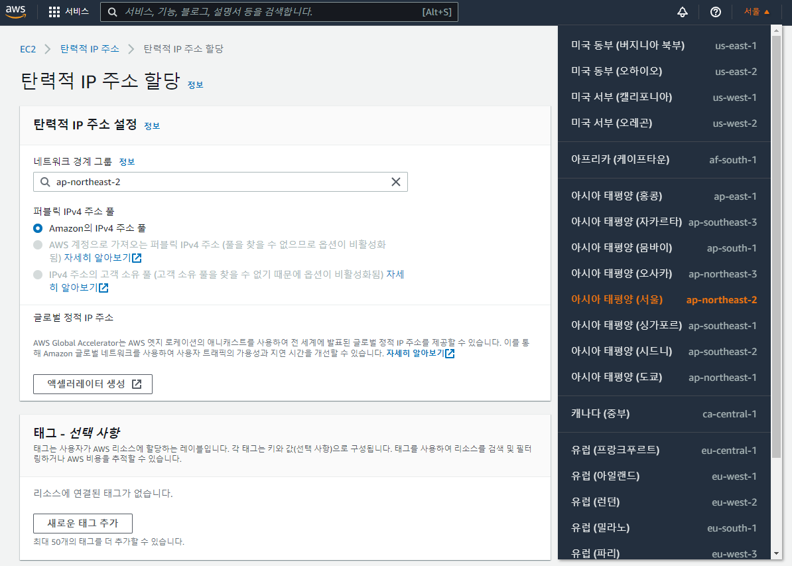
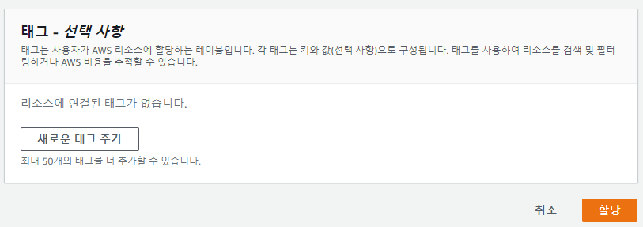
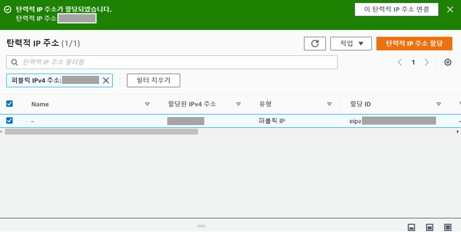
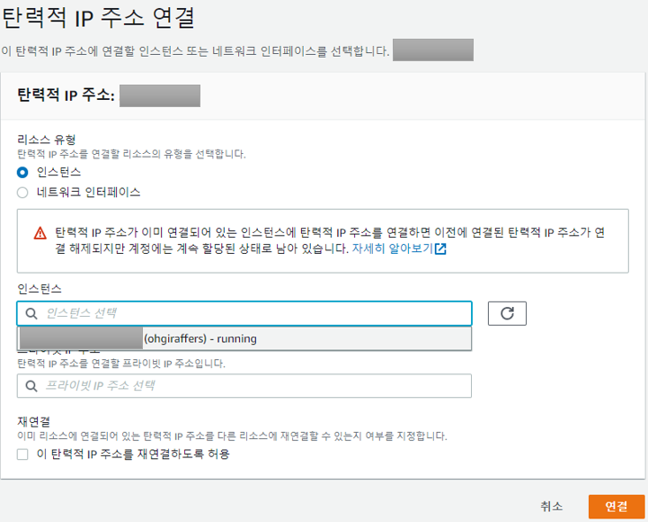
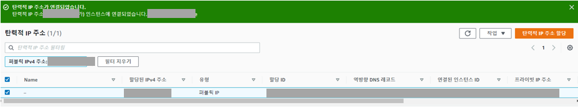

# 5. 탄력적 IP 등록

## 5-1. 탄력적 IP 개요

### 5-1-1. 탄력적 IP 란?

- AWS EC2는 인스턴스를 중지하고 다시 키거나 시간이 지나면 IP가 변경된다.
- IP가 변경되면 웹서비스를 고정적으로 운영할 수가 없다. 따라서 고정 IP를 등록해야한다.
- 프리티어에서는 고정IP를 1개 무료로 사용할 수 있다.
- 단, 고정 IP 할당 후 인스턴스와 연동하지 않으면 요금이 부과된다.

## 5-2. 탄력 IP 세팅

### 5-2-1. 탄력적 IP 할당받기

1. 탄력적 IP 탭으로 이동
> EC2 대시보드에서 좌측에 네트워크 및 보안 범주 안에 탄력적 IP 탭을 눌러 이동후 탄력적 IP 주소 할당을 클릭한다.

2. 탄력적 IP 할당
> 네트워크 경계 그룹은 ap-northeast-2 로 자동세팅되어 있으나, 안되어 있다면 해당 그룹으로 변경한다.
> ap-northeast-2는 아시아 태평양(서울) 리전이다. 설정한후 화면 하단에 할당을 눌러 IP를 받는다.

### 5-2-2. 탄력적 IP 주소 연결

1. IP와 인스턴스 연결 페이지로 이동
> IP 할당 받으면 아래와 같이 확인 페이지로 이동하게 되는데 화면 상단에 탄력적 IP 주소 연결을 눌러 EC2와 연동을 하기 위해 이동한다. 

2. 인스턴스와 IP 연결
> 리소스 유형은 인스턴스이며, 미리 생성해둔 인스턴스와 탄력IP와 연결할 수 있게 세팅한 후 연결을 클릭한다.

3. 탄력적 IP 연결 완료
> 연결이 완료되면 EC2 서버의 고정 아이피까지 설정이 완료되었다.

