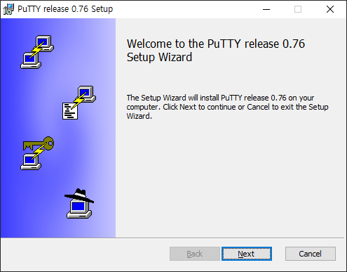

# 6. PuTTY 접속

## 6-1. PuTTY 접속 세팅

### 6-1-1. PuTTY 다운

1. PuTTY 홈페이지 접속
> [PuTTY](https://putty.softonic.kr/) 홈페이지 접속하여 다운로드한다.

2. PuTTY 설치
> PuTTY 설치를 진행한다.

### 6-1-2. PuTTYgen 을 통해 키 생성

1. PuTTYgen 을 실행한다.
> 인스턴스 생성시 만든 .pem 키 쌍에서 개인키를 생성해야한다. 

2. 생성한 키페어를 임포트한다.
> Conversions -> Import key 클릭하여 인스턴스 생성시 만든 .pem파일을 임포트한다.

3. 개인키 생성
> Save private key를 누른다.
> 알림창이 뜨면 예를 누르고 키 페어에서 개인키를 추출해 원하는 위치에 키를 저장한다. 이 키는 절대 유출해서는 안된다.

## 6-2. PuTTY로 AWS 접속

### 6-2-1. PuTTY EC2 인스턴스 접속

> PuTTY로 원격접속시 어느 서버로 접속할 것인지 IP 주소가 필요하다. 이 IP주소는 인스턴스 생성시 연결한 탄력적 IP를 입력하면 된다.

1. 탄력적 IP 확인하기

2. PuTTY에 접속정보 입력하기

3. 접속
> 접속정보 입력후 접속을 시도하면 알림이 뜨는데 Accept나 예를 누르고 진행한다. 
> login as : 에는 ubuntu 를 입력하면 된다.인스턴스를 ubuntu로 생성했기 때문이다. 다른 OS면 계정은 달라진다.

| OS | 계정정보 |
| ---|-----|
| Ubuntu | ubuntu | 
| Amazon Linux2 | ec2-user |
| Amazon Linux | ec2-user |
| Debian | admin / root | 
| Fedora | ec2-user / fedora |

