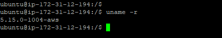
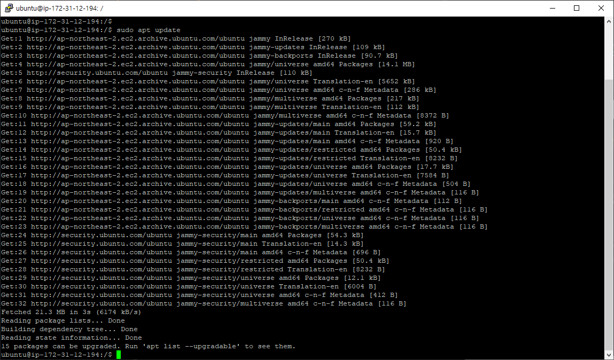

# 7. Docker

## 7-1. AWS에 Docker 세팅하기

### 7-1-1. 설치전 Ubuntu 환경세팅

1. ubuntu 버전 확인
> 커널 버전을 확인한다. Docker는 커널 버전이 최소 3.10 이상이어야 한다.
```powershell
$ uname -r 
```


2. apt 패키지 업데이트
> 처음 EC2인스턴스에 들어오면 최신버전의 ubuntu가 되도록 update를 한번 진행한다.

```powershell
$ sudo apt update 
```

3. 이후 jar 배포를 위해 jdk11 설치
> apt를 활용해 open-jdk 설치

```powershell
// java 11 openJDK 설치
$ apt install openjdk-11-jdk

// 자바 버전 확인
java -version 
```



### 7-1-2. Docker 설치

1. sudo 없이 docker 명령어 사용 세팅

```powershell
// root 계정으로 전환
$ sudo su

// ubuntu라는 일반 계정 다시 전환
$ su - ubuntu

// 처음 EC2인스턴스에 들어오면 update를 한번 진행한다.
$ apt update
```

★★★ 이후 아래에서 진행되는 모든 명령어는 root 계정으로 할 것 ★★★


1. Docker 설치

```powershell
$ curl -fsSL https://get.docker.com -o get-docker.sh
```


3. Docker 권한 설정

```powershell
$ sh get-docker.sh
```


## 7-2. 이미지 Build 및 도커 컨테이너 생성

### 7-2-1. Docker 이미지 빌드 및 컨테이너 생성 후 구동

1. docker 이미지 빌드
> 도커 관련 명령어는 root 권한의 명령어들일 경우 매번 'sudo'를 타이핑 해야 하는데 root 계정으로 전환하면 그럴 필요가 없다.

```powershell
// 도커 이미지에 이름(태그)를 만들어 빌드 시 
$ docker build -t react-image .

// 도커 이미지 빌드(이렇게는 실행하지 말 것, 테스트 용도 아니면)
$ docker build .

// 도커 이미지 검색
$ docker image ls

// 도커 삭제를 원한다면...
$ docker image rm <docker-image-id>

```


2. docker 컨테이너 생성 및 구동

```powershell
// 도커 이미지 검색
$ docker image ls

// 도커 삭제를 원한다면...
$ docker image rm <docker-image-id>

// 만들어진 이미지로 도커 컨테이너를 띄우려면
// docker run -d --name <container-name> <image-name>
$ docker run -d --name react-app react-image

// <리액트는 아래와 같이 포트 포워딩 개념을 해 주어야 돌아간다.>
// 호스트 환경에서 3306으로 접속되는 트래픽을 컨테이너의 3000번 포트로 포워딩 할 것이다.
// docker run -d -p 3306:3000 --name <container-name> <image-name>
$ docker run -d -p 3306:3000 --name  react-app react-image

// 현재 가동중인 컨테이너만 확인
$ docker ps
```


### 7-2-2. Docker 컨테이너 중지 및 제거

```powershell
// 중단 후 제거
$ docker stop <container-name>
$ docker rm <container-name> -f

// 도커리셋
$ docker stop $(docker ps -aq)
$ docker system prune -a
```


### 7-2-3. Docker 허브에 push

```powershell
// 도커 허브 로그인
// Username: 도커허브 아이디
// Password: 도커허브 비번
$ docker login

// 도커 허브에 push
$ docker push react-image

// 도커 허브 로그아웃
$ docker logout
```


### 7-2-4. 이미지 받기

1. docker hub에 있는 이미지 받기
> 기존에 docker hub에 올려놓은 이미지를 pull 한다.

```powershell
$ docker pull {이미지이름}:{태그이름}
```


### 7-2-5. Web으로 접속

> AWS 탄력적 IP와 세팅한 포트를 입력하여 WEB에서 접속 테스트를 해본다.

