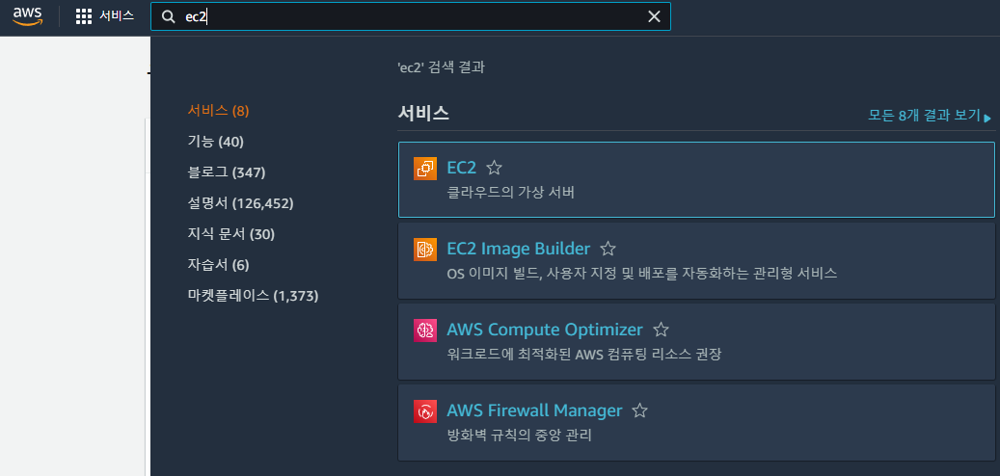
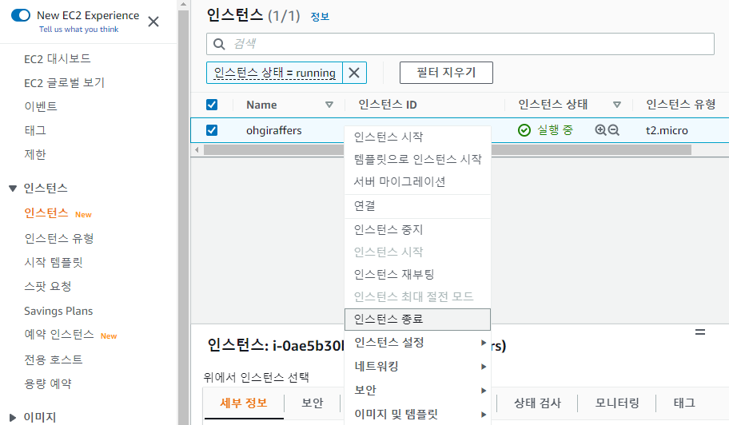
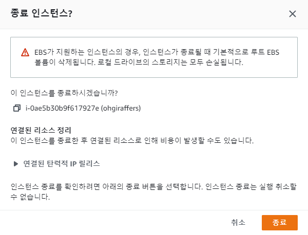
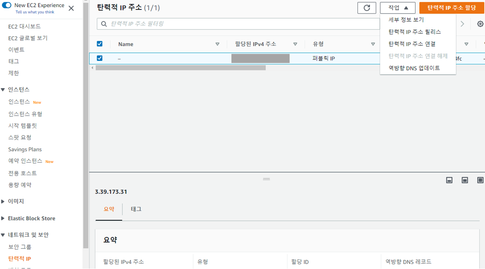
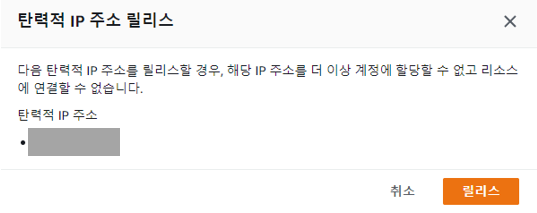
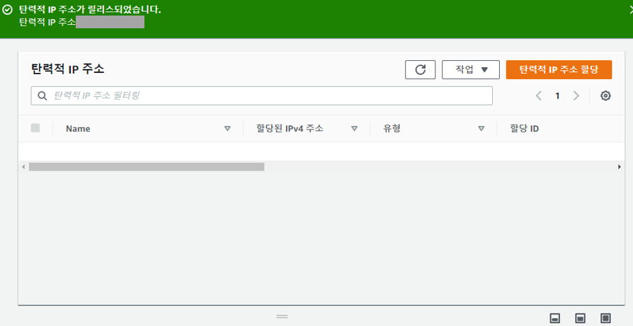

# 8. AWS 삭제하기

## 8-1. AWS 삭제 목록

### 8-1-1. EC2 삭제

1. EC2 페이지로 이동

2. 인스턴스 종료
> AWS는 인스턴스 종료하게되면 인스턴스가 삭제된다. 삭제시 연결된 리소스가 있다는 알림이 보여진다.
> 탄력적 IP의 경우 사용하지 않아도 비용이 발생하기 때문에 해당 서비스도 삭제해준다.

### 8-1-2. 탄력적 IP 삭제

1. 탄력적 IP 탭으로 이동
> EC2 대시보드에서 네트워크 및 보안 탭에 있는 탄력적 IP 를 클릭하면 고정 IP 관리할 수 있는 페이지로 이동한다.

2. 탄력적 IP 릴리스(삭제)

3. 삭제 완료

